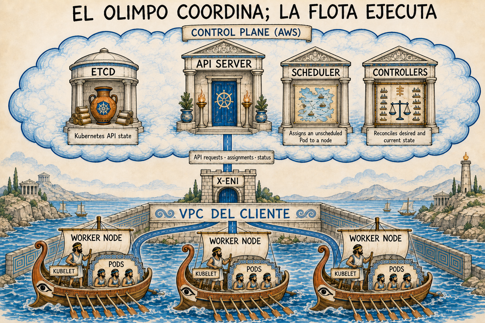

# AWS CLI y Amazon EKS: guía práctica para empezar

Esta es una ruta de aprendizaje en español para entender Amazon EKS desde la línea de comandos. Empieza por el
modelo mental, valida la identidad y la región de AWS, crea un laboratorio, despliega una carga sencilla y termina
eliminando y verificando los recursos que pueden generar costos.

> [!WARNING]
> Amazon EKS y los recursos que lo acompañan generan cargos. No ejecutes el laboratorio en una cuenta de producción.
> Revisa [costos y limpieza](docs/06-costos-y-limpieza.md) **antes** de crear un clúster y elimínalo al terminar.



*El Olimpo representa el plano de control distribuido que opera AWS; cada trirreme representa un worker node del
mismo clúster. La imagen es una puerta de entrada: consulta la
[leyenda y los límites de la metáfora](docs/00-conceptos.md#cómo-leer-la-metáfora) antes de usarla como modelo técnico.*

## Para quién es esta guía

Está pensada para quien:

- conoce lo básico de terminal, contenedores y YAML;
- dispone de una cuenta *sandbox* o de un clúster de práctica autorizado;
- quiere distinguir AWS CLI, `eksctl` y `kubectl` antes de operar EKS;
- acepta trabajar con credenciales temporales, mínimo privilegio y costos visibles.

No es una arquitectura lista para producción ni sustituye las políticas de seguridad, redes, continuidad o costos de
tu organización. La [plantilla empresarial](docs/07-estandar-empresarial.md) empieza donde termina el laboratorio.

## Qué aprenderás

Al completar la ruta podrás:

1. explicar qué administra AWS y qué administras tú en EKS;
2. comprobar cuenta, rol, región y versiones antes de cambiar recursos;
3. conectar de forma limitada un clúster autorizado o crear un laboratorio sin comandos incompletos;
4. conectar `kubectl`, desplegar una carga y diagnosticar su estado;
5. reconocer controles modernos: EKS Access Entries, EKS Pod Identity, registros del plano de control y nodos AL2023
   o Bottlerocket;
6. retirar el laboratorio y comprobar que no dejó recursos evidentes.

## Ruta recomendada

La ruta completa de la tabla corresponde al laboratorio dedicado de la opción B. Si tu organización te entrega un
clúster compartido, completa solo los pasos 0–2 y continúa únicamente con el namespace, manifiestos y comandos que su
propietario haya autorizado; no uses los capítulos de operación o limpieza como un runbook genérico.

| Paso | Tema | Evidencia de finalización |
| --- | --- | --- |
| 0 | [Conceptos y modelo mental](docs/00-conceptos.md) | Puedes diferenciar plano de control, nodos y Pods |
| 1 | [Prerrequisitos seguros](docs/01-prerrequisitos.md) | `aws sts get-caller-identity` muestra la cuenta esperada |
| 2 | [Primer clúster](docs/02-primer-cluster.md) | EKS está `ACTIVE` y `kubectl` consulta el API server |
| 3 | [Operación esencial](docs/03-operacion-esencial.md) | La carga de ejemplo está `Available` y responde localmente |
| 4 | [Seguridad base](docs/04-seguridad.md) | Puedes explicar IAM, RBAC, Access Entries y Pod Identity |
| 5 | [Solución de problemas](docs/05-solucion-de-problemas.md) | Sabes recopilar evidencia sin exponer credenciales |
| 6 | [Costos y limpieza](docs/06-costos-y-limpieza.md) | El clúster ya no existe y revisaste recursos remanentes |

Después consulta la [referencia de comandos](docs/referencia-cli.md) y la
[plantilla de estándar empresarial](docs/07-estandar-empresarial.md).

## Inicio rápido, sin crear recursos

Clona el repositorio y ejecuta las comprobaciones locales:

```bash
git clone https://github.com/sjaramillov/aws-cli-standards.git
cd aws-cli-standards
make check
```

Configura variables explícitas para evitar operar en la cuenta o región equivocada. Sustituye los valores de ejemplo:

```bash
export AWS_PROFILE="mi-sandbox"
export AWS_REGION="us-east-1"
export CLUSTER_NAME="eks-learning"
export EXPECTED_AWS_ACCOUNT_ID="123456789012"
export AWS_PAGER=""

./scripts/preflight.sh
```

Reemplaza el account ID; el script falla si no lo defines o no coincide. `preflight.sh` solo lee configuración y
metadatos: no crea, modifica ni elimina recursos. Si tu organización ya te dio un clúster, continúa en
[conectar un clúster existente](docs/02-primer-cluster.md#opción-a-usar-un-clúster-existente).

## Decisiones que mantienen vigente la guía

- **No se fija una versión en el texto.** La versión del laboratorio se consulta en tiempo de ejecución con
  `aws eks describe-cluster-versions`; las versiones y sus fechas cambian.
- **El laboratorio principal usa un Managed Node Group explícito.** Permite observar el plano de datos, la AMI y el
  escalado. [EKS Auto Mode](docs/02-primer-cluster.md#opción-c-explorar-eks-auto-mode) se presenta como ruta moderna
  alternativa, con su modelo operativo y tarifa adicional.
- **No se recomienda Amazon Linux 2.** AWS dejó de publicar AMIs EKS optimizadas para AL2 el 26 de noviembre de 2025;
  usa AL2023 o Bottlerocket.
- **Personas con credenciales temporales.** Se favorecen federación e IAM Identity Center sobre access keys de larga
  duración.
- **Acceso con EKS Access Entries.** Para clústeres nuevos se evita depender del `aws-auth` ConfigMap heredado.
- **Identidad de Pods con EKS Pod Identity cuando sea compatible.** IRSA continúa siendo válido para casos no
  soportados, como determinadas cargas en Fargate o Windows.
- **El primer servicio es `ClusterIP`.** Se usa `kubectl port-forward` para aprender sin crear un balanceador público.
- **Toda creación tiene un procedimiento de retiro.** Un `delete-cluster` aislado no es un plan de limpieza.

## Fuente y vigencia

Última revisión técnica: **2026-09-02**.

Las afirmaciones técnicas se contrastan con fuentes primarias, entre ellas:

- [Guía de inicio de Amazon EKS](https://docs.aws.amazon.com/eks/latest/userguide/getting-started.html)
- [Ciclo de vida de versiones de Kubernetes en EKS](https://docs.aws.amazon.com/eks/latest/userguide/kubernetes-versions.html)
- [Guía de buenas prácticas de EKS](https://docs.aws.amazon.com/eks/latest/best-practices/introduction.html)
- [EKS Access Entries](https://docs.aws.amazon.com/eks/latest/userguide/access-entries.html)
- [Identidad para Pods](https://docs.aws.amazon.com/eks/latest/userguide/service-accounts.html)
- [Precios de Amazon EKS](https://aws.amazon.com/eks/pricing/)

Consulta la [auditoría de la versión original](docs/auditoria-2026-09.md) para ver hallazgos, remediaciones y
limitaciones de verificación.

## Contribuir y reportar problemas

Lee [CONTRIBUTING.md](CONTRIBUTING.md) antes de proponer cambios. No publiques credenciales, identificadores sensibles
ni detalles explotables en un *issue*; usa el proceso descrito en [SECURITY.md](SECURITY.md).

## Licencia

Este repositorio se distribuye bajo la [licencia MIT](LICENSE).
