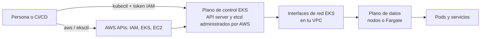

# 0. Conceptos y modelo mental

## Objetivo

Al terminar este capítulo podrás ubicar cada comando en el sistema correcto y explicar la diferencia entre
autenticación, autorización, plano de control y plano de datos.

## EKS en una imagen

Amazon EKS es Kubernetes administrado. AWS opera el plano de control; tú sigues siendo responsable de cómo acceden
las personas, de las cargas, los datos, las imágenes, la red de la VPC y —según el tipo de cómputo— de los nodos.

El plano de control se ejecuta en una VPC administrada por AWS. EKS crea interfaces de red en subredes de tu VPC
para comunicarlo con el plano de datos. El hecho de que AWS administre el API server no vuelve administradas tus
aplicaciones ni sus permisos.

## Tres herramientas, tres propósitos

| Herramienta | Habla con | Úsala para | No asumas que hace |
| --- | --- | --- | --- |
| `aws` | APIs de AWS | Consultar o cambiar clústeres, add-ons, Access Entries e IAM | Crear todos los recursos de una plataforma |
| `eksctl` | Varias APIs de AWS, normalmente mediante CloudFormation | Orquestar el ciclo de vida de un clúster EKS | Ser una API distinta de AWS o reemplazar IaC de producción |
| `kubectl` | API de Kubernetes del clúster seleccionado | Trabajar con Pods, Deployments, Services, RBAC y eventos | Crear VPC, roles IAM o el plano de control EKS |

`aws eks create-cluster` crea el plano de control, pero requiere de antemano roles y red, y no crea por sí solo un
plano de datos completo. Por eso el laboratorio usa `eksctl` con configuración explícita; la
[referencia de AWS CLI](referencia-cli.md) conserva los comandos de bajo nivel para inspección y automatización.

## Autenticación no es autorización

El recorrido normal de `kubectl` es:

1. `aws eks update-kubeconfig` registra endpoint, CA y un comando para obtener un token.
2. `kubectl` ejecuta `aws eks get-token` con una identidad IAM temporal.
3. EKS autentica esa identidad.
4. EKS Access Entries y/o Kubernetes RBAC determinan qué puede hacer.

Un error `Unauthorized` puede significar que el token no es válido. Un error `Forbidden` normalmente significa que
la identidad sí fue reconocida, pero no tiene autorización para esa operación.

Para clústeres nuevos, EKS Access Entries es el mecanismo preferido de acceso humano. El `aws-auth` ConfigMap queda
como mecanismo heredado y ruta de migración, no como punto de partida.

## Identidades que no debes mezclar

| Identidad | Para qué sirve |
| --- | --- |
| Rol de la persona o del pipeline | Llamar APIs de AWS y autenticarse ante Kubernetes |
| Rol del clúster EKS | Permitir que el servicio EKS administre recursos necesarios |
| Rol del nodo | Permitir que kubelet y componentes del nodo trabajen con AWS |
| Rol de la aplicación | Dar a un ServiceAccount permisos mínimos mediante EKS Pod Identity o IRSA |

No entregues a un Pod las credenciales del rol del nodo. AWS recomienda EKS Pod Identity cuando el tipo de cómputo y
el SDK son compatibles; IRSA sigue siendo una alternativa válida, por ejemplo para determinados Pods en Fargate o
Windows.

## Opciones de cómputo

| Opción | Qué aprendes o delegas | Consideración principal |
| --- | --- | --- |
| Managed Node Group | Ves EC2, AMI, Auto Scaling Group y actualizaciones de nodos | Tú planificas capacidad y upgrades |
| EKS Auto Mode | AWS administra más del cómputo, red, balanceo y almacenamiento | Tiene tarifa adicional y otro modelo operativo |
| Fargate | AWS administra la infraestructura de cada Pod | No soporta todos los patrones de Kubernetes |
| Karpenter | Aprovisionamiento dinámico y flexible de nodos | Es un componente operativo avanzado |

El laboratorio principal usa un Managed Node Group porque hace visibles las piezas. Esto no convierte esa opción en
la única correcta para producción.

## Comprobación de aprendizaje

Antes de continuar, deberías poder responder:

- ¿Qué herramienta usarías para listar clústeres EKS? ¿Y para listar Pods?
- ¿Por qué un clúster `ACTIVE` puede no tener nodos `Ready`?
- ¿Qué diferencia hay entre una Access Entry y un `RoleBinding`?
- ¿Por qué el rol del nodo no debe ser el rol de la aplicación?

## Fuentes oficiales

- [Arquitectura del plano de control EKS](https://docs.aws.amazon.com/eks/latest/best-practices/control-plane.html)
- [Modelo de responsabilidad compartida de EKS](https://docs.aws.amazon.com/eks/latest/best-practices/security.html)
- [Acceso al clúster con EKS Access Entries](https://docs.aws.amazon.com/eks/latest/userguide/access-entries.html)
- [Comparación de identidad para ServiceAccounts](https://docs.aws.amazon.com/eks/latest/userguide/service-accounts.html)
- [Opciones de cómputo de Amazon EKS](https://docs.aws.amazon.com/eks/latest/userguide/eks-compute.html)

[Siguiente: prerrequisitos seguros →](01-prerrequisitos.md)
