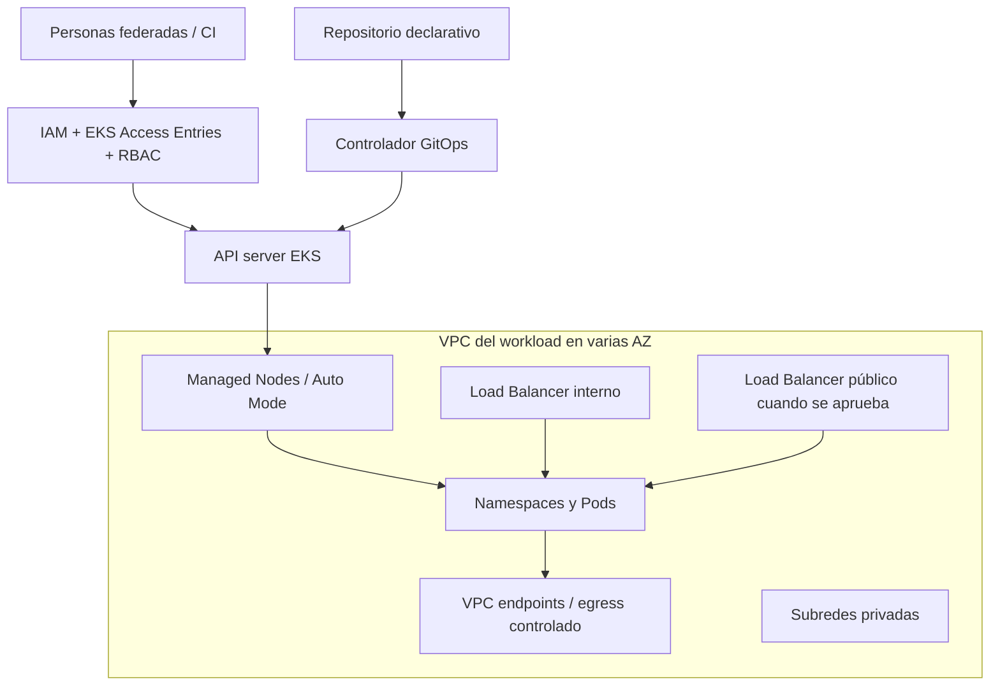

# Plantilla de estándar empresarial para Amazon EKS

> [!IMPORTANT]
> Esta es una **plantilla pública**, no una certificación ni una arquitectura aprobada. Cada requisito debe tener
> propietario, mecanismo, evidencia, excepción y fecha de revisión. Adáptala mediante el proceso de arquitectura,
> seguridad, riesgo, costos y continuidad de tu organización.

## Control del documento

| Campo | Valor a completar |
| --- | --- |
| ID | `EKS-STD-___` |
| Servicio/plataforma | `___` |
| Propietario | `___` |
| Aprobadores | `Arquitectura / Seguridad / FinOps / Operaciones` |
| Estado | `Borrador / Aprobado / Retirado` |
| Clasificación | `Pública / Interna / Confidencial` |
| Versión | `0.1.0` |
| Vigente desde | `AAAA-MM-DD` |
| Próxima revisión | `AAAA-MM-DD` |
| Repositorio de IaC | `___` |
| Runbooks y evidencias | `___` |

No marques un borrador como “Activo”. Si la clasificación es interna, no publiques el documento ni sus diagramas en
un repositorio público.

## 1. Propósito y alcance

Este estándar define decisiones y controles verificables para clústeres EKS de `___` en cuentas `___`, regiones
`___` y clases de datos `___`.

Incluye:

- plano de control, cómputo, red, almacenamiento y add-ons;
- acceso humano y de workloads;
- entrega de software y políticas de admisión;
- observabilidad, respuesta, continuidad y upgrades;
- costos, etiquetado, excepciones y retiro.

Excluye explícitamente: `___`.

## 2. Principios

1. **Mínimo privilegio:** personas y workloads usan roles temporales con alcance mínimo.
2. **Estado reproducible:** infraestructura y configuración declarativa se revisan por pull request.
3. **Defensa en profundidad:** IAM, RBAC, red, admisión, runtime y detección se complementan.
4. **Fallas contenidas:** cuentas, clústeres, namespaces y AZ delimitan impactos según el riesgo.
5. **Evidencia antes que afirmaciones:** cada control produce una prueba consultable.
6. **Costo como restricción:** disponibilidad, observabilidad y seguridad incluyen presupuesto y atribución.
7. **Retiro diseñado:** todo recurso tiene propietario, fecha, retención y procedimiento de eliminación.

## 3. Decisiones de arquitectura

El AWS Well-Architected Framework no prescribe una topología “hub-and-spoke”. Documenta cada elección y su contexto:

| Decisión | Opciones evaluadas | Elección y razón | Consecuencia/rollback |
| --- | --- | --- | --- |
| Cuentas | Compartida / por entorno / por dominio | `___` | `___` |
| Cómputo | MNG / Auto Mode / Fargate / Karpenter | `___` | `___` |
| API endpoint | Privado / público restringido / ambos | `___` | `___` |
| Familia de Pods/Services | IPv4 / IPv6 | `___` | `___` |
| Direccionamiento externo | IPv4 / IPv6 / dual-stack en VPC, endpoint o LB según soporte | `___` | `___` |
| Egress | NAT / VPC endpoints / proxy / aislado | `___` | `___` |
| Ingress | ALB / NLB / Gateway API / ninguno | `___` | `___` |
| Identidad Pods | Pod Identity / IRSA | `___` | `___` |
| Entrega | Argo CD / Flux / pipeline controlado | `___` | `___` |
| Policies | PSA / Kyverno / Gatekeeper | `___` | `___` |
| Observabilidad | CloudWatch / AMP / OpenSearch / otro | `___` | `___` |

Arquitectura conceptual — sustituye IDs y flujos con un diagrama aprobado:

## 4. Línea base del clúster

### 4.1 Cuenta, región y ciclo de vida

- El clúster vive en una cuenta y región aprobadas; producción no comparte cuenta con laboratorios.
- Nombres y tags identifican producto, entorno, propietario, centro de costo, clasificación y fecha de revisión.
- La versión de Kubernetes permanece en soporte estándar salvo excepción aprobada y temporal.
- La política de upgrade define ventana, una minor por paso, Upgrade Insights, pruebas y rollback.
- Deletion protection está habilitada fuera de entornos efímeros.
- El plano de control usa el tier estándar salvo justificación y prueba de carga para capacidad provisionada.

### 4.2 Red

- El plano de datos de producción se distribuye en al menos dos AZ; la aplicación define su propio objetivo de
  disponibilidad.
- Nodos de propósito general viven en subredes privadas; no tienen SSH público.
- El endpoint privado está habilitado. El público se deshabilita o limita a CIDRs controlados.
- DNS de VPC, espacio IP, al menos seis IP libres por subnet del clúster —AWS recomienda al menos 16— y cuotas se
  validan antes de cambios.
- Subredes para Load Balancers se etiquetan según esquema interno o público; no se mezclan por conveniencia.
- Egress se documenta por destino y costo. Un clúster privado declara VPC endpoints, DNS y rutas necesarios.
- El motor de NetworkPolicy se habilita, monitorea y prueba; existe default-deny donde el modelo lo requiera.
- Se evalúan prefix delegation, IPv6 o redes adicionales antes de que el agotamiento de IP sea un incidente.

### 4.3 Cómputo

- Se documenta por qué se eligió Managed Node Groups, Auto Mode, Fargate o Karpenter.
- Nodos usan AL2023, Bottlerocket u otra imagen soportada; AL2 no es una base aprobada para nuevos grupos.
- IMDSv2 está requerido y el acceso de Pods al rol del nodo está restringido.
- Acceso operativo evita SSH rutinario y deja auditoría.
- Node groups separan cargas por riesgo/capacidad mediante labels, taints y tolerations revisados.
- Autoscaling tiene límites, presupuestos, métricas y protección frente a escalado explosivo.
- Reparación de nodos y disrupciones se prueban contra PDB, topology spread y capacidad de reemplazo.

### 4.4 Add-ons

- VPC CNI, CoreDNS, kube-proxy, CSI, ingress y observabilidad tienen propietario y versión compatible.
- Se prefieren EKS add-ons cuando cumplen el caso; cualquier componente autogestionado tiene ciclo de parches.
- Policies/configuración actuales se preservan conscientemente durante upgrades; no se usa overwrite indiscriminado.
- Los add-ons reciben IAM mediante Pod Identity o IRSA, no por permisos amplios heredados del nodo.

## 5. Identidad y acceso

### 5.1 Personas y automatización

- IAM Identity Center/federación y MFA son obligatorios para personas.
- Se usan roles separados de lectura, operación y administración; no hay usuarios compartidos.
- Clústeres nuevos usan EKS Access Entries. `aws-auth` solo se tolera durante una migración con fecha final.
- El bootstrap admin del creador está deshabilitado o transferido a una identidad de emergencia controlada.
- Access policies y RBAC se prueban por verbos/namespaces, incluidos casos de denegación.
- Credenciales de CI son temporales, idealmente por federación OIDC, y limitadas al pipeline/repositorio.
- Accesos y bindings se recertifican con periodicidad `___`.

### 5.2 Workloads

- Cada aplicación usa un ServiceAccount dedicado y un rol mínimo.
- EKS Pod Identity es la opción por defecto cuando sea compatible; IRSA se documenta para excepciones/portabilidad.
- No hay access keys en imágenes, variables estáticas, Kubernetes Secrets, ConfigMaps ni repositorios.
- Roles sensibles incorporan conditions, session tags y controles cross-account cuando corresponda.
- La aplicación demuestra acceso al recurso permitido y denegación a uno fuera de alcance.

## 6. Seguridad de workloads y cadena de suministro

- Namespaces aplican Pod Security Admission de forma progresiva `audit` → `warn` → `enforce`.
- Workloads se ejecutan no-root, sin privilege escalation, con seccomp y capabilities mínimas.
- Privileged/hostPath/hostNetwork/hostPID requieren excepción temporal y controles compensatorios.
- Se definen requests; límites de memoria y CPU responden a pruebas, SLO y comportamiento del runtime.
- Imágenes provienen de registros aprobados, se despliegan por digest, se escanean y tienen procedencia verificable.
- Admission policies bloquean criterios definidos y cuentan con tests y modo de recuperación.
- SBOM, firma, vulnerabilidades y excepción de CVE siguen una política con SLA.

## 7. Datos, secretos y almacenamiento

- Secrets Manager u otro almacén aprobado conserva secretos; rotación y acceso se prueban.
- Envelope encryption de la API de Kubernetes se entiende y no se confunde con cifrado de EBS/EFS/logs.
- StorageClass, cifrado, KMS, snapshots, expansión, backups y reclaim policy son explícitos.
- Los datos definen RPO/RTO, región, retención, residencia y prueba de restauración.
- El retiro del clúster incluye una decisión por cada PV, snapshot, backup y clave KMS.

## 8. Observabilidad y operación

- Se habilitan logs de control plane según riesgo, al menos `audit` y `authenticator`, con retención y acceso aprobados.
- CloudTrail y audit logs de Kubernetes se correlacionan; se monitorean cambios de acceso y configuración.
- Métricas cubren plano de control, nodos, CNI, DNS, storage, workloads, colas y saturación.
- Alertas enlazan runbook, severidad, SLO, responsable y mecanismo de escalamiento.
- Logs no contienen secretos y tienen límites de volumen/costo.
- Incidentes, pérdida de AZ, node replacement y restauración se ensayan y producen acciones rastreables.

## 9. Entrega, cambios y drift

- Infraestructura se gestiona con una herramienta IaC aprobada, versiones fijadas y plan revisado.
- Configuración Kubernetes declarativa se reconcilia mediante GitOps o pipeline equivalente con identidad limitada.
- Acceso manual de escritura está restringido, auditado y reservado para incidentes/runbooks.
- Drift se detecta; una corrección manual de emergencia tiene ticket, expiración y reconciliación posterior.
- PRs exigen revisión, checks y segregación para cambios de alto impacto.
- El rollback se diseña por tipo: manifest, add-on, nodo, control plane, datos y red.

GitOps es una decisión operativa válida, no una razón para prohibir todo `kubectl` de diagnóstico. Define qué verbos se
permiten y en qué contexto.

## 10. Disponibilidad, upgrades y continuidad

- Aplicaciones críticas usan réplicas, topology spread/PDB y capacidad suficiente para mantenimiento.
- Upgrades revisan APIs deprecadas, Upgrade Insights, compatibilidad, IP libre, backups y ventanas.
- Se actualizan y validan control plane, nodos/Fargate, workloads, add-ons y clientes; nada se presume automático.
- Se documenta la ventana vigente de rollback de control plane y sus límites.
- Backups protegen estado y datos requeridos, y una restauración se prueba con frecuencia `___`.
- Multi-región o multi-clúster se adopta solo cuando RTO/RPO y análisis de fallas justifican complejidad/costo.

## 11. FinOps

- Tags de asignación y Cost Categories atribuyen control plane, EC2, storage, red y observabilidad.
- Presupuestos/alertas cubren cuenta y producto, sabiendo que no son límites duros.
- Se monitorean versiones en soporte extendido, capacidad ociosa, NAT, cross-AZ, IPv4 y retención de logs.
- Requests y nodos se ajustan con datos; Spot se usa según tolerancia a interrupción.
- Cada arquitectura registra el costo esperado normal, máximo y durante recuperación.

## 12. Retiro

El runbook debe eliminar en orden:

1. tráfico, Ingress y Services que aprovisionan balanceadores;
2. workloads y recursos externos controlados por Kubernetes;
3. datos según retención: PVC/PV, EBS/EFS, snapshots y backups;
4. node groups, Fargate profiles, Auto Mode/EKS capabilities;
5. deletion protection y plano de control;
6. stacks, red, IP, IAM, logs, DNS, certificados y recursos independientes;
7. evidencia final por cuenta, región, tags y facturación.

## 13. Catálogo mínimo de controles

| ID | Requisito | Mecanismo | Evidencia | Propietario | Frecuencia |
| --- | --- | --- | --- | --- | --- |
| EKS-IAM-01 | Acceso humano temporal | IAM Identity Center + Access Entries | Reporte de accesos y pruebas RBAC | SecOps/Platform | Trimestral |
| EKS-NET-01 | API no abierta globalmente | Endpoint privado/CIDR | Configuración EKS + prueba negativa | Platform | Continua |
| EKS-WRK-01 | Identidad por workload | Pod Identity/IRSA | Asociación + policy + prueba | App/Platform | Por release |
| EKS-POD-01 | Pods restringidos | PSA + policy engine | Resultados de admisión | App/SecOps | Continua |
| EKS-IMG-01 | Imagen aprobada | ECR/scanner/admission | Digest, firma y escaneo | App/SecOps | Por imagen |
| EKS-OBS-01 | Auditoría disponible | EKS logs + CloudTrail | Consulta y retención | SecOps | Mensual |
| EKS-LCM-01 | Versión soportada | Calendario + pipeline | Dashboard y prueba upgrade | Platform | Mensual |
| EKS-BCP-01 | Restauración probada | Backup/runbook | Evidencia de restore | Platform/App | Según RTO |
| EKS-CST-01 | Costo atribuible | Tags/Budgets/Cost Explorer | Reporte y alertas | FinOps | Mensual |
| EKS-END-01 | Retiro sin residuos | Runbook/inventario | Checklist y consulta billing | Platform/FinOps | Por retiro |

Amplía la tabla con criterios de aceptación cuantificables y enlaces exactos; “herramienta instalada” no es evidencia
de que un control funciona.

## 14. RACI inicial

| Actividad | Platform | App | SecOps | FinOps | Negocio |
| --- | :---: | :---: | :---: | :---: | :---: |
| Arquitectura y ciclo de vida del clúster | R/A | C | C | C | I |
| Red, nodos y add-ons | R/A | I | C | C | I |
| Workloads y SLO de aplicación | C | R/A | C | C | I |
| IAM/RBAC y policies | R | C | A | I | I |
| Secretos y respuesta a incidentes | C | R | A | I | I |
| Presupuesto y asignación | C | C | I | R/A | I |
| RPO/RTO y aceptación de riesgo | C | R | C | C | A |
| Retiro y verificación | R | C | C | A | I |

Adapta el RACI a nombres reales. Toda fila necesita una única `A` claramente identificada.

## 15. Excepciones

Una excepción válida incluye:

- control afectado y justificación de negocio;
- alcance exacto y evaluación de riesgo;
- controles compensatorios;
- propietario y aprobador;
- fecha de inicio y caducidad;
- evidencia/monitorización;
- plan de remediación y criterio de cierre.

Las excepciones sin caducidad son decisiones arquitectónicas no documentadas.

## Fuentes de referencia

- [Amazon EKS Best Practices Guide](https://docs.aws.amazon.com/eks/latest/best-practices/introduction.html)
- [AWS Well-Architected Framework](https://docs.aws.amazon.com/wellarchitected/latest/framework/welcome.html)
- [EKS Access Entries](https://docs.aws.amazon.com/eks/latest/userguide/access-entries.html)
- [Ciclo de versiones EKS](https://docs.aws.amazon.com/eks/latest/userguide/kubernetes-versions.html)
- [Requisitos de VPC y subredes de EKS](https://docs.aws.amazon.com/eks/latest/userguide/network-reqs.html)
- [Optimización de costos EKS](https://docs.aws.amazon.com/eks/latest/best-practices/cost-opt.html)

[← Volver al README](../README.md)
